# VisualizacionDatos
Recopilación de codigos para realizar graficos cn python, usando las libreiras más recomendadas para la visualización de datos
## Herramientas para la visualización de datos
La visualización de datos es una gran parte de los trabajos de un cientifico de datos.
Crear visualozaciones realmente ayuda a que las cosas sean más claras y fáciñes de entender, especialemnte con conjunto de datos más grande y de alta dimensión.
Presentar sus resultados de una menra clara, concisa y convincente.
Audiencia a menudo clientes no técnicos pueda entender.

Matplotlib es una popular biblioteca de python que se puede usar para crear visualizaciones de datos con bastante fácillidad.

### Grafico de dispersión.-
Los diagramas de dispersión son excelentes para mostrar la relación entre variables. 


```python
import matplotlib.pyplot as plt
import numpy as np

def scatterplot(x_data, y_data, x_label="", y_label="", title="", color = "r", yscale_log=False):

    # Create the plot object
    _, ax = plt.subplots()

    # Plot the data, set the size (s), color and transparency (alpha)
    # of the points
    ax.scatter(x_data, y_data, s = 10, color = color, alpha = 0.75)

    if yscale_log == True:
        ax.set_yscale('log')

    # Label the axes and provide a title
    ax.set_title(title)
    ax.set_xlabel(x_label)
    ax.set_ylabel(y_label)
    
```

### Line Plots


```python
def lineplot(x_data, y_data, x_label="", y_label="", title=""):
    # Create the plot object
    _, ax = plt.subplots()

    # Plot the best fit line, set the linewidth (lw), color and
    # transparency (alpha) of the line
    ax.plot(x_data, y_data, lw = 2, color = '#539caf', alpha = 1)

    # Label the axes and provide a title
    ax.set_title(title)
    ax.set_xlabel(x_label)
    ax.set_ylabel(y_label)
```

### Histograms


```python
def histogram(data, n_bins, cumulative=False, x_label = "", y_label = "", title = ""):
    _, ax = plt.subplots()
    ax.hist(data, n_bins = n_bins, cumulative = cumulative, color = '#539caf')
    ax.set_ylabel(y_label)
    ax.set_xlabel(x_label)
    ax.set_title(title)
```


```python
# Overlay 2 histograms to compare them
def overlaid_histogram(data1, data2, n_bins = 0, data1_name="", data1_color="#539caf", data2_name="", data2_color="#7663b0", x_label="", y_label="", title=""):
    # Set the bounds for the bins so that the two distributions are fairly compared
    max_nbins = 10
    data_range = [min(min(data1), min(data2)), max(max(data1), max(data2))]
    binwidth = (data_range[1] - data_range[0]) / max_nbins


    if n_bins == 0:
    	bins = np.arange(data_range[0], data_range[1] + binwidth, binwidth)
    else: 
    	bins = n_bins

    # Create the plot
    _, ax = plt.subplots()
    ax.hist(data1, bins = bins, color = data1_color, alpha = 1, label = data1_name)
    ax.hist(data2, bins = bins, color = data2_color, alpha = 0.75, label = data2_name)
    ax.set_ylabel(y_label)
    ax.set_xlabel(x_label)
    ax.set_title(title)
    ax.legend(loc = 'best')
```

### Bar Plots


```python
def barplot(x_data, y_data, error_data, x_label="", y_label="", title=""):
    _, ax = plt.subplots()
    # Draw bars, position them in the center of the tick mark on the x-axis
    ax.bar(x_data, y_data, color = '#539caf', align = 'center')
    # Draw error bars to show standard deviation, set ls to 'none'
    # to remove line between points
    ax.errorbar(x_data, y_data, yerr = error_data, color = '#297083', ls = 'none', lw = 2, capthick = 2)
    ax.set_ylabel(y_label)
    ax.set_xlabel(x_label)
    ax.set_title(title)


def stackedbarplot(x_data, y_data_list, colors, y_data_names="", x_label="", y_label="", title=""):
    _, ax = plt.subplots()
    # Draw bars, one category at a time
    for i in range(0, len(y_data_list)):
        if i == 0:
            ax.bar(x_data, y_data_list[i], color = colors[i], align = 'center', label = y_data_names[i])
        else:
            # For each category after the first, the bottom of the
            # bar will be the top of the last category
            ax.bar(x_data, y_data_list[i], color = colors[i], bottom = y_data_list[i - 1], align = 'center', label = y_data_names[i])
    ax.set_ylabel(y_label)
    ax.set_xlabel(x_label)
    ax.set_title(title)
    ax.legend(loc = 'upper right')


def groupedbarplot(x_data, y_data_list, colors, y_data_names="", x_label="", y_label="", title=""):
    _, ax = plt.subplots()
    # Total width for all bars at one x location
    total_width = 0.8
    # Width of each individual bar
    ind_width = total_width / len(y_data_list)
    # This centers each cluster of bars about the x tick mark
    alteration = np.arange(-(total_width/2), total_width/2, ind_width)

    # Draw bars, one category at a time
    for i in range(0, len(y_data_list)):
        # Move the bar to the right on the x-axis so it doesn't
        # overlap with previously drawn ones
        ax.bar(x_data + alteration[i], y_data_list[i], color = colors[i], label = y_data_names[i], width = ind_width)
    ax.set_ylabel(y_label)
    ax.set_xlabel(x_label)
    ax.set_title(title)
    ax.legend(loc = 'upper right')
```

### Box Plots


```python
def boxplot(x_data, y_data, base_color="#539caf", median_color="#297083", x_label="", y_label="", title=""):
    _, ax = plt.subplots()

    # Draw boxplots, specifying desired style
    ax.boxplot(y_data
               # patch_artist must be True to control box fill
               , patch_artist = True
               # Properties of median line
               , medianprops = {'color': median_color}
               # Properties of box
               , boxprops = {'color': base_color, 'facecolor': base_color}
               # Properties of whiskers
               , whiskerprops = {'color': base_color}
               # Properties of whisker caps
               , capprops = {'color': base_color})

    # By default, the tick label starts at 1 and increments by 1 for
    # each box drawn. This sets the labels to the ones we want
    ax.set_xticklabels(x_data)
    ax.set_ylabel(y_label)
    ax.set_xlabel(x_label)
    ax.set_title(title)
```

https://towardsdatascience.com/5-quick-and-easy-data-visualizations-in-python-with-code-a2284bae952f

### LIBRERIA SEARBON 

Para utilizar la librería Seaborn en primer lugar se han de cargar un conjunto de datos. Para ello se puede utilizar el conjunto de datos de propinas que se encuentra en la propia librería. Para ello se ha de importar el método load_dataset y cargar el conjunto de datos 'tips'. 


```python
    from seaborn import load_dataset
    tips.head()
```


<div>
<style scoped>
    .dataframe tbody tr th:only-of-type {
        vertical-align: middle;
    }

    .dataframe tbody tr th {
        vertical-align: top;
    }

    .dataframe thead th {
        text-align: right;
    }
</style>
<table border="1" class="dataframe">
  <thead>
    <tr style="text-align: right;">
      <th></th>
      <th>total_bill</th>
      <th>tip</th>
      <th>sex</th>
      <th>smoker</th>
      <th>day</th>
      <th>time</th>
      <th>size</th>
    </tr>
  </thead>
  <tbody>
    <tr>
      <th>0</th>
      <td>16.99</td>
      <td>1.01</td>
      <td>Female</td>
      <td>No</td>
      <td>Sun</td>
      <td>Dinner</td>
      <td>2</td>
    </tr>
    <tr>
      <th>1</th>
      <td>10.34</td>
      <td>1.66</td>
      <td>Male</td>
      <td>No</td>
      <td>Sun</td>
      <td>Dinner</td>
      <td>3</td>
    </tr>
    <tr>
      <th>2</th>
      <td>21.01</td>
      <td>3.50</td>
      <td>Male</td>
      <td>No</td>
      <td>Sun</td>
      <td>Dinner</td>
      <td>3</td>
    </tr>
    <tr>
      <th>3</th>
      <td>23.68</td>
      <td>3.31</td>
      <td>Male</td>
      <td>No</td>
      <td>Sun</td>
      <td>Dinner</td>
      <td>2</td>
    </tr>
    <tr>
      <th>4</th>
      <td>24.59</td>
      <td>3.61</td>
      <td>Female</td>
      <td>No</td>
      <td>Sun</td>
      <td>Dinner</td>
      <td>4</td>
    </tr>
  </tbody>
</table>
</div>


### Grafico de dispersión con Seabon

Uno de los primeros gráficos que se pueden realizar con estos datos es un gráfico de dispersión. Mediante el cual se puede ver la relación entre dos variables como puede ser la factura y la propina.

Este tipo de gráfico se puede obtener mediante el método lmplot al que se le ha de indicar la característica para el cada uno de los ejes y el conjunto de datos.Como se muestra en el siguiente ejemplo:


```python
    from seaborn import lmplot
    lmplot('total_bill', 'tip', data=tips, fit_reg=False)
```


    <seaborn.axisgrid.FacetGrid at 0x7f0ee0d3db70>


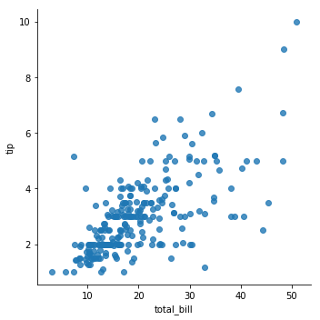


En el ejemplo se puede ver una opción fit_reg a la que se ha asignado el valor falso, esto es necesario dado que por defecto realiza la regresión lineal. 


```python
    lmplot('total_bill', 'tip', data=tips)
```


    <seaborn.axisgrid.FacetGrid at 0x7f0ede4444e0>


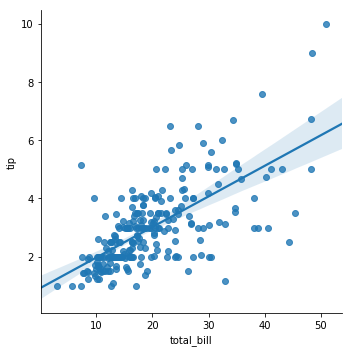


La gráfica así obtenida incluye además de los datos incluye la regresión lineal y el intervalo de confianza. El intervalo de confianza se puede fijar con la propiedad ci, pudiendo indicar el intervalo deseado o None para que se omita. 


```python
    lmplot('total_bill', 'tip', data=tips, ci=None)
```


    <seaborn.axisgrid.FacetGrid at 0x7f0ede4006d8>


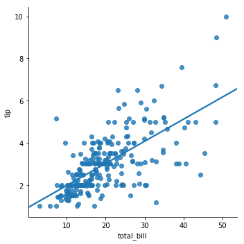


Una característica interesante se lmplot es la posibilidad de representar más de una regresión a la vez. Para ello solamente se le ha de utilizar la propiedad hue a la que le ha de indicar el nombre de la columna de dataframe que se desea utilizar para separar


```python
lmplot(x="total_bill", y="tip", hue="smoker", data=tips)
```


    <seaborn.axisgrid.FacetGrid at 0x7f0ede38ec18>


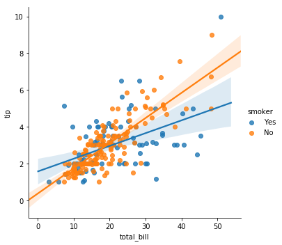


### Diagrama de densidad

Los diagramas de densidad se pueden utilizar para ver cómo se comporta distribuciones de datos. 
Seaborn este tipo de diamgramas se puede obtener con el método kdeplot. 


```python
from seaborn import kdeplot
kdeplot(tips.total_bill)
```


    <matplotlib.axes._subplots.AxesSubplot at 0x7f0edc283208>


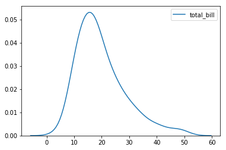


```python
kdeplot(tips.tip, tips.total_bill)
```


    <matplotlib.axes._subplots.AxesSubplot at 0x7f0edc1430f0>


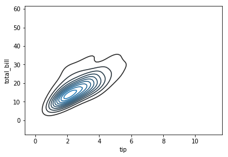


```python
from seaborn import distplot
distplot(tips.total_bill)
```


    <matplotlib.axes._subplots.AxesSubplot at 0x7f0edc1476a0>


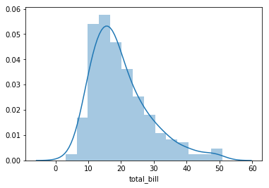


Si no se desea que el histograma incluya también el diagrama de densidad se ha de indicar asignando el valor falso a la opción kde


```python
distplot(tips.total_bill, kde=False)
```


    <matplotlib.axes._subplots.AxesSubplot at 0x7f0edc0b44e0>


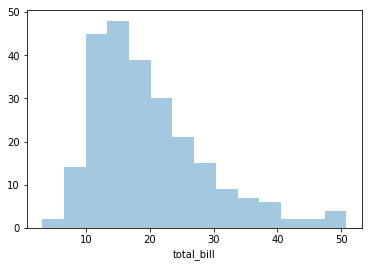


Puedes eliminar es el histograma configurando la opción hist a falso


```python
    distplot(tips.total_bill, hist=False)
```


    <matplotlib.axes._subplots.AxesSubplot at 0x7f0edc0d9ba8>


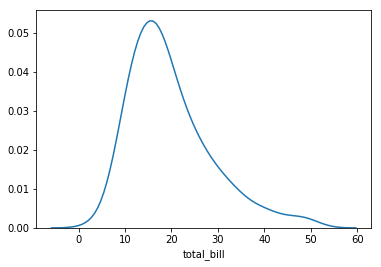


distplot permite agregar también un gráfico de alfombra, para lo que se ha inyectar el valor true a la propiedad rug


```python
distplot(tips.total_bill, rug=True, hist=False)
```


    <matplotlib.axes._subplots.AxesSubplot at 0x7f0edc053710>


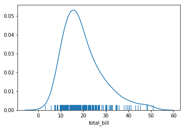


Finalmente se puede hacer el gráfico vertical, para lo que se ha de propiedad vertical ha de ser verdadera.


```python
distplot(tips.total_bill, vertical=True)
```


    <matplotlib.axes._subplots.AxesSubplot at 0x7f0edc01a5f8>


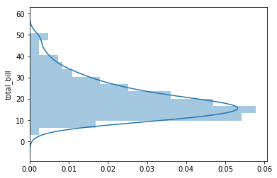


### Boxplot

La dispersión de datos se puede comprobar también mediante los gráficos de tipo boxplot. Lo que se pueden obtener mediante el método boxplot


```python
from seaborn import boxplot
boxplot(tips.total_bill)
```


    <matplotlib.axes._subplots.AxesSubplot at 0x7f0edbf736d8>


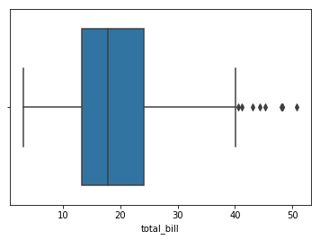


Para que la representación sea vertical simplemente se ha mediante la propiedad orient.


```python
boxplot(tips.total_bill, orient="v")
```


    <matplotlib.axes._subplots.AxesSubplot at 0x7f0edbf28320>


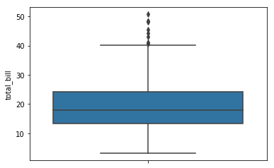


Representar más de una gráfico tipo boxplot permite comparar la dispersión de los datos al poder ver los resultados de forma conjunta.


```python
boxplot(x="sex", y="total_bill", data=tips)
```


    <matplotlib.axes._subplots.AxesSubplot at 0x7f0edbf5d240>


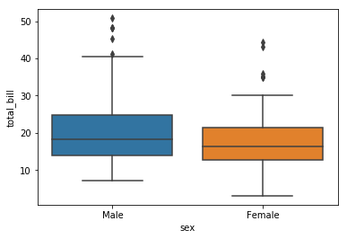


De forma análoga a los gráficos de dispersión en serabon también se puede dividir las gráficas boxplot en base una tercera columna.Es posible poder analizar el comportamiento de más de un conjunto de datos con la propiedad hue.


```python
boxplot(x="sex", y="total_bill", hue="smoker", data=tips)
```


    <matplotlib.axes._subplots.AxesSubplot at 0x7f0edbea75f8>


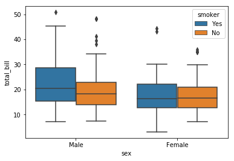


### Violin

serabon también incluye los gráficos de tipo violín como alternativa a los boxplot. Esto se utilizan se generan con el método violinplot 


```python
from seaborn import violinplot
violinplot(x="sex", y="total_bill", hue="smoker", data=tips)
```


    <matplotlib.axes._subplots.AxesSubplot at 0x7f0edbe82080>


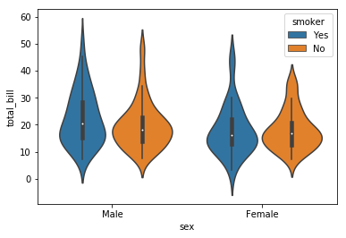


https://www.analyticslane.com/2018/07/20/visualizacion-de-datos-con-seaborn/

### Multiple plot


```python
import seaborn as sns
import matplotlib.pyplot as plt
sns.set(style="ticks")
tips = sns.load_dataset("tips")
g = sns.FacetGrid(tips, col="time")

```


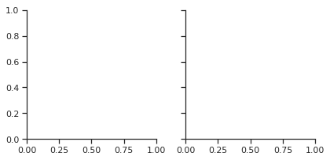


```python
import seaborn as sns
import matplotlib.pyplot as plt
sns.set(style="ticks")
tips = sns.load_dataset("tips")
g = sns.FacetGrid(tips, col="time")
g.map(plt.hist, "tip");
```


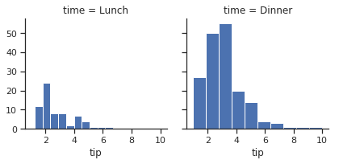


```python

```
